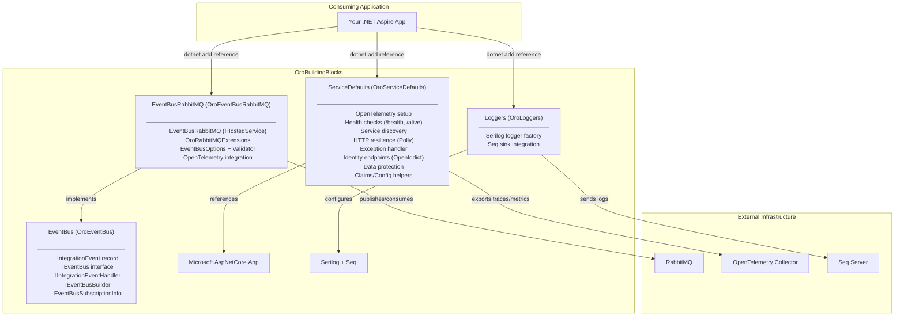
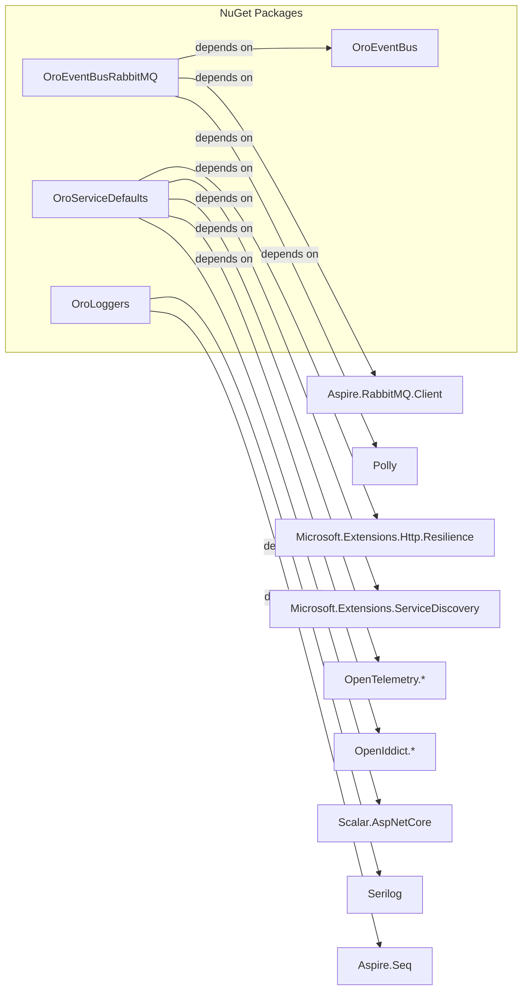
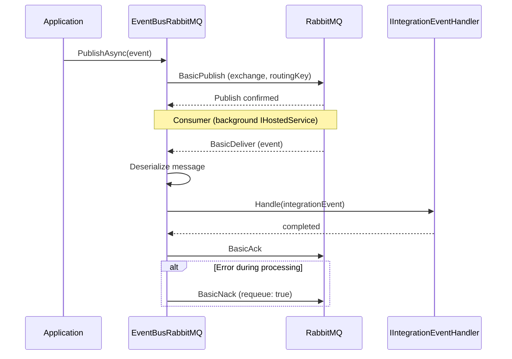

# OroBuildingBlocks Architecture

```mermaid
flowchart TB
    subgraph "OroBuildingBlocks"
        direction TB

        EB["EventBus (OroEventBus)
        ─────────────────────
        IntegrationEvent record
        IEventBus interface
        IIntegrationEventHandler
        IEventBusBuilder
        EventBusSubscriptionInfo"]

        EBRM["EventBusRabbitMQ (OroEventBusRabbitMQ)
        ───────────────────────────────
        EventBusRabbitMQ (IHostedService)
        OroRabbitMQExtensions
        EventBusOptions + Validator
        OpenTelemetry integration"]

        SD["ServiceDefaults (OroServiceDefaults)
        ─────────────────────────────
        OpenTelemetry setup
        Health checks (/health, /alive)
        Service discovery
        HTTP resilience (Polly)
        Exception handler
        Identity endpoints (OpenIddict)
        Data protection
        Claims/Config helpers"]

        LG["Loggers (OroLoggers)
        ─────────────────
        Serilog logger factory
        Seq sink integration"]

        EBRM -->|implements| EB
        SD -->|references| MF["Microsoft.AspNetCore.App"]
        LG -->|configures| SL["Serilog + Seq"]
    end

    subgraph "Consuming Application"
        APP["Your .NET Aspire App"]
        APP -->|dotnet add reference| SD
        APP -->|dotnet add reference| LG
        APP -->|dotnet add reference| EBRM
    end

    subgraph "External Infrastructure"
        RMQ["RabbitMQ"]
        OTLP["OpenTelemetry Collector"]
        SEQ["Seq Server"]
    end

    EBRM -->|publishes/consumes| RMQ
    SD  -->|exports traces/metrics| OTLP
    LG  -->|sends logs| SEQ
```

## Package Dependency Graph

```mermaid
flowchart LR
    subgraph "NuGet Packages"
        OEB["OroEventBus"]
        OEBRM["OroEventBusRabbitMQ"]
        OSD["OroServiceDefaults"]
        OL["OroLoggers"]
    end

    OEBRM -->|depends on| OEB
    OEBRM -->|depends on| AspireRabbitMQ["Aspire.RabbitMQ.Client"]
    OEBRM -->|depends on| Polly
    OSD  -->|depends on| MResilience["Microsoft.Extensions.Http.Resilience"]
    OSD  -->|depends on| MDiscovery["Microsoft.Extensions.ServiceDiscovery"]
    OSD  -->|depends on| OTel["OpenTelemetry.*"]
    OSD  -->|depends on| OIddict["OpenIddict.*"]
    OSD  -->|depends on| Scalar["Scalar.AspNetCore"]
    OL   -->|depends on| Serilog
    OL   -->|depends on| AspireSeq["Aspire.Seq"]
```

## Component Interaction

```mermaid
sequenceDiagram
    participant App as Application
    participant EB as EventBusRabbitMQ
    participant RMQ as RabbitMQ
    participant Handler as IIntegrationEventHandler

    App->>EB: PublishAsync(event)
    EB->>RMQ: BasicPublish (exchange, routingKey)
    RMQ-->>EB: Publish confirmed

    Note over EB,RMQ: Consumer (background IHostedService)
    RMQ-->>EB: BasicDeliver (event)
    EB->>EB: Deserialize message
    EB->>Handler: Handle(integrationEvent)
    Handler-->>EB: completed
    EB->>RMQ: BasicAck

    alt Error during processing
        EB->>RMQ: BasicNack (requeue: true)
    end
```
